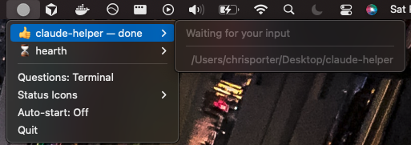

# Claude Helper

**Keep tabs on Claude Code — without leaving what you're doing.**

A cross-platform system tray utility that shows what Claude is up to at a glance and lets you respond to permission prompts without switching to the terminal.

<p align="center">
  
  &nbsp;&nbsp;&nbsp;&nbsp;
  
</p>

Works on **macOS** and **Windows**.

## Features

- **System tray status indicator** — see what Claude is doing without context-switching
- **Permission requests** — Allow or Deny tool usage directly from the system tray
- **Elicitation questions** — view (and optionally answer) Claude's questions from the system tray
- **Multi-session support** — track multiple concurrent Claude Code sessions
- **VS Code detection** — automatically detects VS Code vs terminal and adjusts behavior
- **Auto-start** — optionally launch on login (launchd on macOS, Registry on Windows)

## Tray Icons

| Icon | Meaning | Default Emoji |
|------|---------|---------------|
| Gray hollow circle | No active sessions | — |
| Gray circle filling up/down (animated) | Claude is actively working | ⌛ |
| Blue ring with emoji | A session needs permission (e.g. tool use approval) | 🔴 |
| Blue ring with emoji | A session has a question for you | 🔵 |
| Filled gray circle | A session has finished or is idle, waiting for your input | 🟡 |

Status emojis are customizable via the **Status Icons** submenu in the tray.

## Setup

### macOS / Linux

Requires **Python 3**.

```bash
./setup.sh
```

### Windows

Requires **Python 3**.

```powershell
.\setup.ps1
```

Setup will:
1. Create a Python virtual environment at `~/.claude-helper/venv`
2. Install dependencies (`pystray`, `Pillow`, `psutil`)
3. Create state directories
4. Merge hook configuration into `~/.claude/settings.json`

## Running

### macOS / Linux

```bash
~/.claude-helper/venv/bin/python claude_helper.py
```

### Windows

```powershell
& "$env:USERPROFILE\.claude-helper\venv\Scripts\python.exe" claude_helper.py
```

To auto-start on login, click **Auto-start: Off** in the system tray dropdown.

## How It Works

Claude Helper uses Claude Code's [hooks system](https://docs.anthropic.com/en/docs/claude-code/hooks) to track session lifecycle events:

| Hook | Script | Purpose |
|------|--------|---------|
| SessionStart | `session_start.py` | Registers session, detects VS Code vs terminal |
| SessionEnd | `session_end.py` | Cleans up session directory |
| UserPromptSubmit | `prompt_submit.py` | Marks session as "working" |
| PermissionRequest | `permission_request.py` | Shows Allow/Deny in tray (blocking in terminal, non-blocking in VS Code) |
| PreToolUse | `elicitation_request.py` | Captures elicitation questions |
| PostToolUse | `elicitation_cleanup.py`, `tool_activity.py` | Cleans up questions, resets stale status |
| Notification | `notification.py` | Tracks idle and permission states |
| Stop | `stop.py` | Marks session as done |

All state is stored as JSON files under `~/.claude-helper/`. The tray app polls this directory every 2 seconds. Dead sessions (where the Claude Code process has exited) are automatically cleaned up.

## VS Code vs Terminal

The `session_start.py` hook auto-detects whether Claude Code is running inside VS Code or a standalone terminal:

- **Terminal mode**: Permission requests block and poll for your response in the system tray. Elicitation questions can be answered in the tray (menubar mode) or in the terminal.
- **VS Code mode**: Permission requests are non-blocking — VS Code shows its own native dialog. The tray icon briefly turns blue for Bash commands, then auto-clears after 10 seconds.

## Elicitation Modes

Toggle between modes via the **Questions** menu item:

- **Terminal** (default) — questions appear in the tray as read-only notifications; you answer in the terminal as usual
- **Tray** — questions are interactive; click an option in the tray to answer, and the hook relays your choice back to Claude Code

## Requirements

- macOS or Windows
- Python 3
- [pystray](https://github.com/moses-palmer/pystray), [Pillow](https://pillow.readthedocs.io/), [psutil](https://github.com/giampaolo/psutil) (installed automatically by setup)
