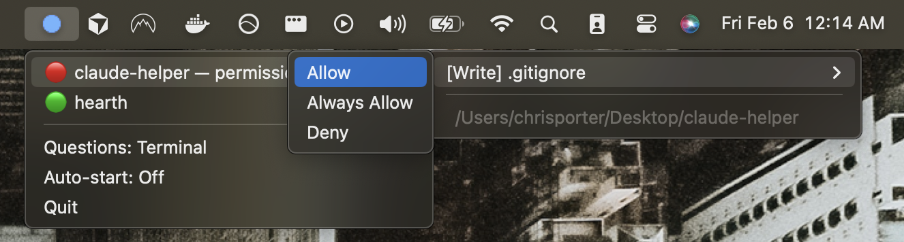
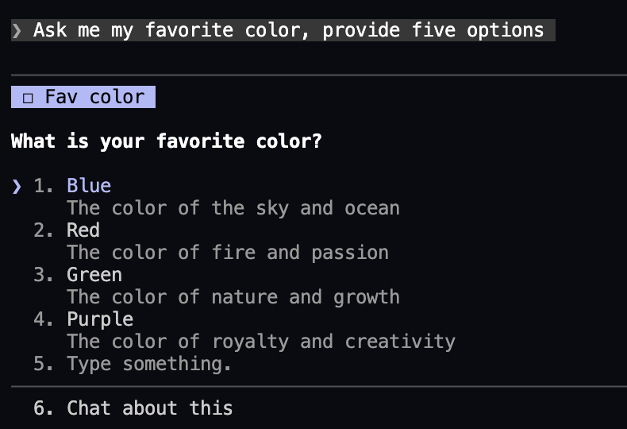
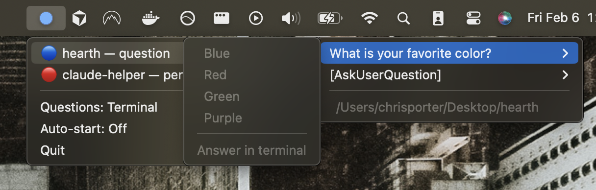

# Claude Helper

A macOS menu bar utility for [Claude Code](https://docs.anthropic.com/en/docs/claude-code). Shows session status at a glance and lets you respond to permission prompts without switching to the terminal.



## Features

- **Menu bar status indicator** — see what Claude is doing without context-switching
- **Permission requests** — Allow, Always Allow, or Deny tool usage directly from the menu bar
- **Elicitation questions** — view (and optionally answer) Claude's questions from the menu bar
- **Multi-session support** — track multiple concurrent Claude Code sessions
- **Auto-start** — optionally launch on login via launchd

## Menu Bar Icons

| Icon | Meaning |
|------|---------|
| Hollow circle (follows system theme) | All sessions are working normally |
| Blue filled circle | A session needs your attention (permission request or question) |
| Yellow filled circle | A session has finished or is idle, waiting for input |

## Session Status Icons

| Icon | Meaning |
|------|---------|
| Red dot | Permission needed — expand to Allow/Deny |
| Blue dot | Question pending — Claude is asking you something |
| Yellow dot | Done or idle — waiting for your next prompt |
| Green dot | Working — Claude is actively running |

## Setup

Requires **Python 3** and **jq** (`brew install jq`).

```bash
./setup.sh
```

This will:

1. Create a Python virtual environment at `~/.claude-helper/venv`
2. Install the `rumps` dependency
3. Make all hook scripts executable
4. Merge hook configuration into `~/.claude/settings.json`

## Running

Start the menu bar app:

```bash
~/.claude-helper/venv/bin/python claude_helper.py
```

To auto-start on login, click **Auto-start: Off** in the menu bar dropdown.

## How It Works

Claude Helper uses Claude Code's [hooks system](https://docs.anthropic.com/en/docs/claude-code/hooks) to track session lifecycle events:

- **SessionStart/SessionEnd** — registers and cleans up sessions in `~/.claude-helper/sessions/`
- **UserPromptSubmit** — marks a session as "working" when you send a message
- **PermissionRequest** — blocking hook that shows the request in the menu bar and polls for your response
- **PreToolUse (AskUserQuestion)** — captures elicitation questions for display
- **Notification/Stop** — tracks idle and completion states

All state is stored as JSON files under `~/.claude-helper/`. The menu bar app polls this directory every 2 seconds. Dead sessions (where the Claude Code process has exited) are automatically cleaned up.

## Elicitation Modes

When Claude asks a question in the terminal, it also appears in the menu bar:

| Terminal | Menu Bar |
|----------|----------|
|  |  |

Toggle between modes via the **Questions** menu item:

- **Terminal** (default) — questions appear in the menu bar as read-only notifications; you answer in the terminal as usual
- **Menu Bar** — questions are interactive; click an option in the menu bar to answer, and the hook relays your choice back to Claude Code

## Requirements

- macOS
- Python 3
- [rumps](https://github.com/jaredks/rumps) (installed automatically by setup)
- jq (for setup only)
